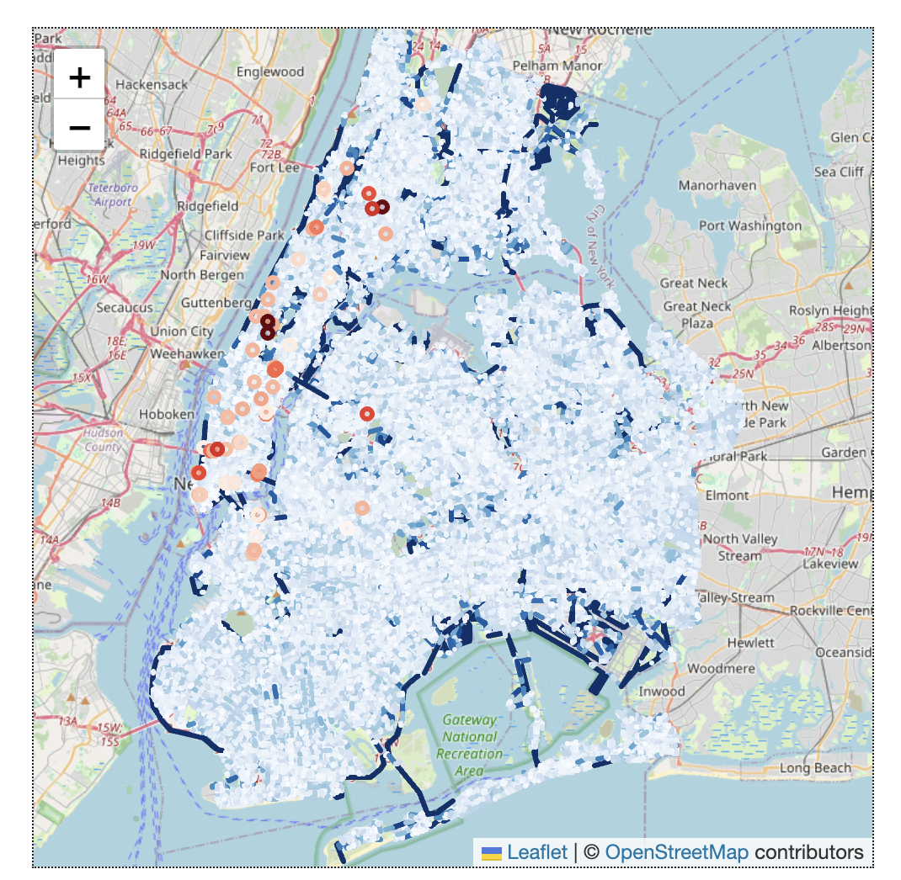
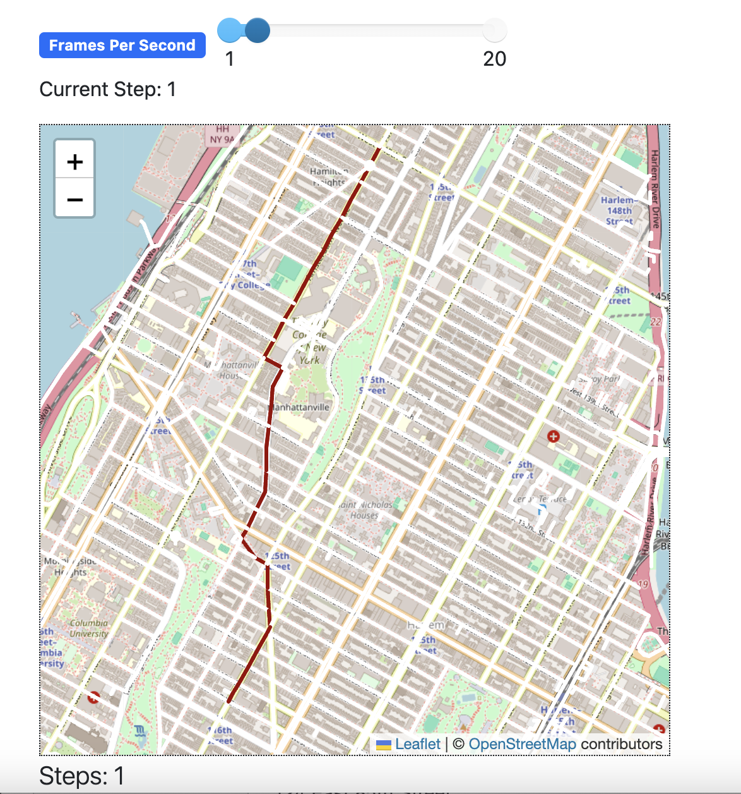

## Agent Based Model for Bikers in NYC

The files in this directory implement an agent based model based on Citibike and Open Street Map data of New York. 
Run the run.py file to start the model. 

I developed an agent-based model to analyze bike lane infrastructure in New York City, using Python, PyTorch, and OpenStreetMap. 
The project focuses on understanding the impact of the urban heat island effect on micro mobility patterns, aiming to identify areas disproportionately affected by climate change. 
This effort sought to improve access to transportation, creating equal opportunities for people to reach jobs and community resources, reinforcing my commitment to enhancing connectivity and equal opportunity across communities.

Red represents individual bikers along their route in the hottest part of the day. The darker the red shade the more heat they have accumulated.
Blue represents road segments and the amount of heat they have contributed on average to bikers. Darker blue means a greater contributor to heat. 
The map is interactive and you can see the bikers move along their path. 

The above photo demonstrates the feature for the model to highlight the hottest relative route in terms of heat exposure/average exposure time.
The model then logs the metrics of the road segments that contributed the most heat.